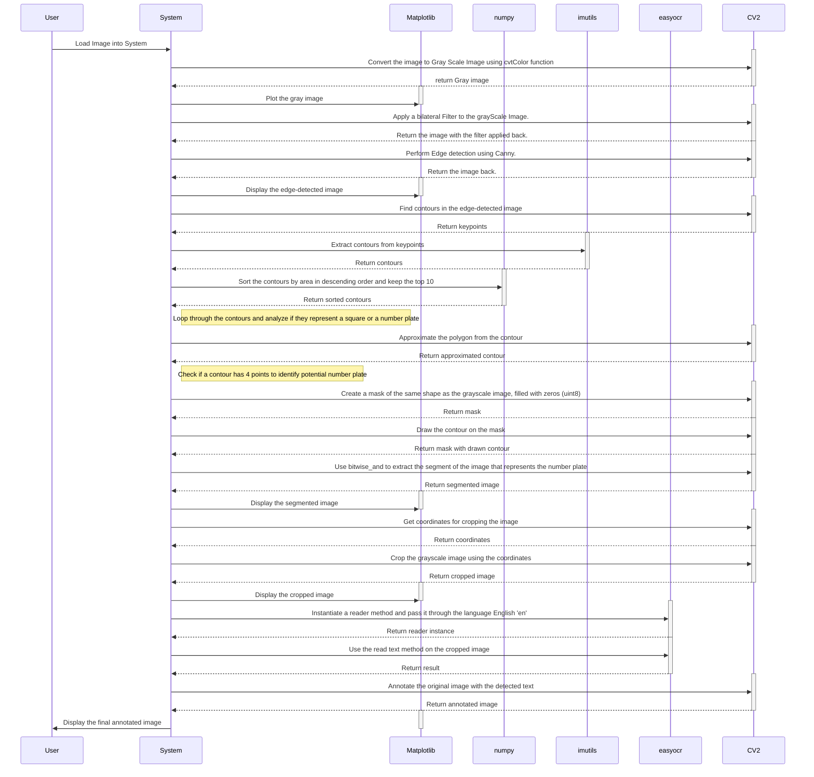

# Image Processing Pipeline

This repository contains an image processing pipeline using OpenCV, numpy, imutils, easyocr, and Matplotlib. The pipeline processes an image to detect and annotate number plates.

## Dockerfile

The Dockerfile sets up the environment required to run the Jupyter Notebook. It uses the latest Ubuntu image and installs the necessary Python packages.

### Steps:
1. Use the latest Ubuntu image.
2. Update the package list and install Python 3, pip, and virtual environment.
3. Create and activate a virtual environment, then install necessary Python packages (`jupyter`, `numpy`, `pandas`, `opencv-python`, `imutils`, `matplotlib`).
4. Set the working directory to `/main`.
5. Copy the contents of the current directory to `/main` in the container.
6. Set the entrypoint to run Jupyter Notebook.
main.ipynb

The Jupyter Notebook `main.ipynb` processes an image using the following steps:

1. **Image Reading and Display:**
   - Load and display an image using OpenCV and Matplotlib.

2. **Grayscale Conversion:**
   - Convert the image to grayscale.

3. **Bilateral Filtering:**
   - Apply a bilateral filter for noise reduction.

4. **Edge Detection:**
   - Perform edge detection using the Canny edge detector.

5. **Find and Sort Contours:**
   - Find contours in the edge-detected image and sort them to identify potential number plates.

6. **Segment and Crop Image:**
   - Segment the image to isolate the number plate and crop it.

7. **Text Recognition:**
   - Use easyocr to read text from the cropped image.

8. **Annotate Original Image:**
   - Annotate the original image with detected text.

## Sequence Diagram


## Running the Project

To run the project, build and run the Docker container:
```sh
#Build the Docker image
docker build -t image-processing-pipeline.
```
```sh
#Run the Docker container
docker run -p 8888:8888 image-processing-pipeline
```
Access the Jupyter Notebook by navigating to http://localhost:8888 in your web browser.

## Requirements
  - Docker
  - Basic knowledge of Jupyter Notebooks and Python
  - Understanding of OpenCV for image processing

## Contributing
Feel free to fork this repository and submit pull requests. Contributions are welcome!

## License
This project is licensed under the MIT License.

## Note
Make sure that your repository settings on GitHub support the rendering of Mermaid diagrams. If Mermaid diagrams do not render correctly on GitHub, you may need to use an external viewer or plugin that supports Mermaid, or include a static image of the diagram instead.

